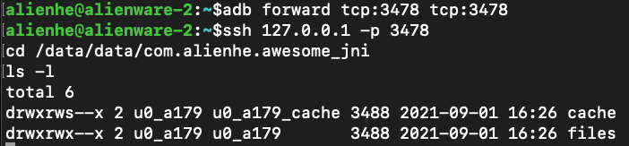

# [SSHDroid](https://github.com/virjarRatel/sshdroid)

# 用途
由于平头哥的设计出发点是实现一个免Root环境下的逆向套件，因此有的时候可能会遇到想要读取应用/data/data/$packageName目录下的文件单ADB没有权限的窘境。

使用SSHDroid便可以完美解决该问题，使用效果与正常shell命令一致。

# 使用效果



只需配置并安装SSHDroid插件，便可在本机上通过ssh命令直接登录设备，并任意访问目标app的私有data目录文件，或者scp拷贝文件，甚至如果通过内网穿透等将端口转发，还可以实现远程ssh。

基于这个，我们还制作了[ratel-bakup-tools](./bakup-tools.md)的GUI工具，在windows/linux/mac上快速备份/还原应用data目录。

> PS：目前的shell命令交互展示还未进行优化

# 使用方法

1. 复制文件: ``app/src/main/assets/config.template.properties``-> `` app/src/main/assets/config.properties``
2. 修改内容
    - targetPackage: 需要被注入的目标应用包名
    - ssdServerPort: 启动的端口号，请注意不要和其他服务冲突
    - newProcess: 是否需要在新进程中启动,如果你的app开启了平头哥的分身功能，并且想要访问data目录下的真实文件，那么请务必设置为true。
3. 安装插件并在RatelManager中勾选插件，启动目标应用(不是启动SSHDroid插件APP)
4. 在电脑上面运行** adb forward **,如： ``adb forward tcp:3478 tcp:3478``
5. 使用电脑连接服务，如：
    - ssh 127.0.0.1 -p 3478 登陆shell
    - scp -P 3478 ./test.txt 127.0.0.1:/data/data/xxx/files/
    - scp -P 3478 127.0.0.1:/data/data/xxx/files/aaa.log ~/Desktop/

# 原理浅析
SSHDroid核心是在目标应用进程中启动一个SSHD服务，SSHDroid本身是一个平头哥插件，类似于Xposed插件，在插件生效时会进行SSHD的相关启动操作。

但如何在Android中启动一个的Java进程？

如果配置了newProcess，那么会通过app_process来执行``com.virjar.sshdroid.SSHD``的main方法：

> (CLASSPATH=/data/app/com.virjar.sshdroid-8B7N2qglntciJJqw0mXFig==/base.apk /system/bin/app_process /system/bin --nice-name=SSHDroid:com.alienhe.awesome_jni com.virjar.sshdroid.SSHD 3478 /data/user/0/com.alienhe.awesome_jni/files)&

即通过app_process(frameworks\base\cmds\app_process\app_main.cpp)即zygote进程来执行某个Java类。源码中有很多这种方式的实现，例如通过adb shell 调用am、pm等，am的脚本内容中就是对app_process的调用：

```
#!/system/bin/sh
#Script to start "am" on the device, which has a very rudimentary shell.

base=/system
export CLASSPATH=$base/framework/am.jar
exec app_process $base/bin com.android.commands.am.Am "$@"
```
