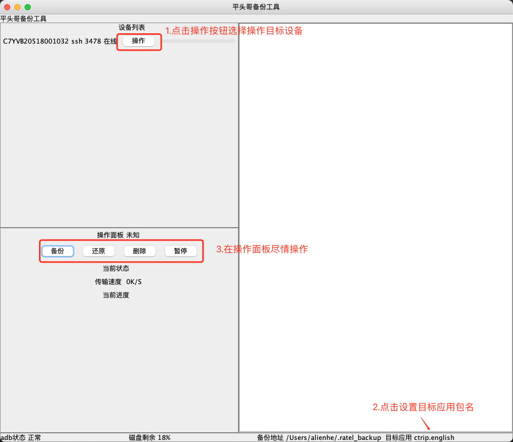

# [应用备份工具](https://github.com/virjarRatel/ratel-bakup-tools)

依赖[SSHDroid](./SSHdroid.md)一起食用，可以通过GUI备份/还原应用data目录下文件。

## 使用方法

### 一、开箱即用
1. 下载bakuptool-release.zip并解压
2. 进入bin目录，运行BackupTool.sh或者BackupTool.bat即可启动bakup-tools
3. 参考SSHDroid文档配置并安装SSHDroid，启动目标应用
4. 点击右下角目标应用设置SSHDroid中配置的目标包名
5. 按照GUI界面进行操作

### 二、编译&运行
1. 修改com.virjar.ratel.backup.v2.Configs#getOpApp方法返回值为要操作的目标应用包名
2. 执行create-dist.sh，执行完成后编译产物在target目录下，进入target/bakuptool-release目录
3. 进入bin目录，运行BackupTool.sh或者BackupTool.bat即可启动bakup-tools
4. 参考SSHDroid文档配置并安装SSHDroid，启动目标应用
5. 点击右下角目标应用设置SSHDroid中配置的目标包名
6. 按照GUI界面进行操作